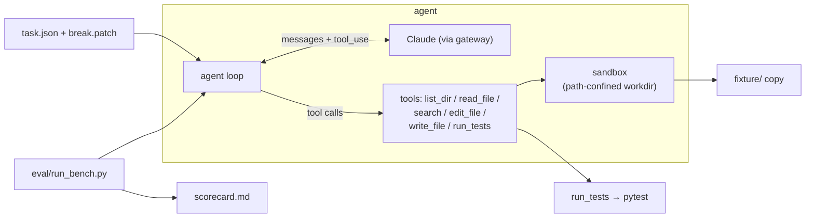

# fixpoint

> A test-driven autonomous coding agent, built from scratch.
> Hand it a repo and a red test suite — it locates the code, edits it, runs the
> tests, reads the red/green, and iterates until the suite is green. Then it's
> scored pass/fail on a controlled task set, with no self-reported results.

<!-- badges: keep to 3-4, all must be real & green -->


<!-- TODO: demo.gif — 8–15s, one task going red → agent loop → green -->


## Why this exists

<!-- 2–3 sentences: a controlled, teaching-grade re-implementation of the
     "give it a task, it edits code and runs tests until green" loop that tools
     like Claude Code do — small enough to read end-to-end, rigorous enough to
     be measured pass@1 on a fixed benchmark. -->

## Architecture



## Quickstart

```bash
# Python 3.9 on macOS/Linux
python3.9 -m venv .venv
source .venv/bin/activate
pip install -r requirements.txt

# secrets: copy the template and fill in your gateway creds
cp .env.example .env
# edit .env → set ANTHROPIC_API_KEY and ANTHROPIC_BASE_URL

# solve a single task (streams the loop to your terminal)
python cli.py solve 001_mul_precedence

# run the whole benchmark → writes eval/scorecard.md
python cli.py bench
```

## Results

<!-- TODO: replace with real numbers from `python cli.py bench` -->

| model                  | pass@1 | avg steps | avg tokens | avg cost |
|------------------------|:------:|:---------:|:----------:|:--------:|
| claude-opus-4.8        |  TODO  |   TODO    |    TODO    |   TODO   |

### Ablations

<!-- TODO: fill after v1. Shows what each capability is worth. -->

| variant                          | pass@1 | avg steps |
|----------------------------------|:------:|:---------:|
| opus-4.8 (baseline)              |  TODO  |   TODO    |
| opus-4.8 + embedding retrieval   |  TODO  |   TODO    |
| opus-4.8 + self-correction       |  TODO  |   TODO    |
| haiku (weaker brain)             |  TODO  |   TODO    |

## How it works

- **The loop** — <!-- TODO: 2–3 lines: model sees the task, calls tools, observes
  results, iterates; bounded by MAX_STEPS and a per-task cost budget. -->
- **The tools** — `list_dir`, `read_file`, `search`, `edit_file`, `write_file`,
  `run_tests`. <!-- TODO: 1 line each; all paths confined to the task workdir. -->
- **The task set** — a single pristine `fixture/`: a compact arithmetic-expression
  evaluator in three stages — `tokenizer` (source → tokens), `parser` (tokens → AST
  via recursive descent, with real operator precedence, left-associativity, and
  unary minus), and `evaluator` (AST → number; true division, divide-by-zero
  raises), over a shared `errors` hierarchy. The pristine library is fully green:
  51 pytest cases across the three stages plus end-to-end integration. Each task
  then applies a `break.patch` that breaks exactly one function, turning a known
  subset of those tests red; the agent has to make the suite green again.
- **Scoring** — a harness independently re-runs `pytest` against the pristine
  tests. A task is *solved* iff the target test passes **and** no other test
  newly fails. The model is never trusted to grade itself. <!-- TODO: expand. -->

## Project layout

```text
agent/    loop, tools, sandbox, llm, config
tasks/    fixture/ (pristine lib + tests) + NNN_*/ (task.json + break.patch)
eval/     run_bench.py, scorecard.md
tests/    unit tests for the agent's own tools
cli.py    solve / bench entrypoints
```

## Limitations & non-goals

<!-- TODO: honest list. single fixture domain (arithmetic evaluator);
     string-replace edits only; not a general coding agent; cost depends on the
     gateway; agent behavior is not bit-reproducible (LLM sampling); embedding
     retrieval is English-only (bge-small-en). -->

## License

MIT
