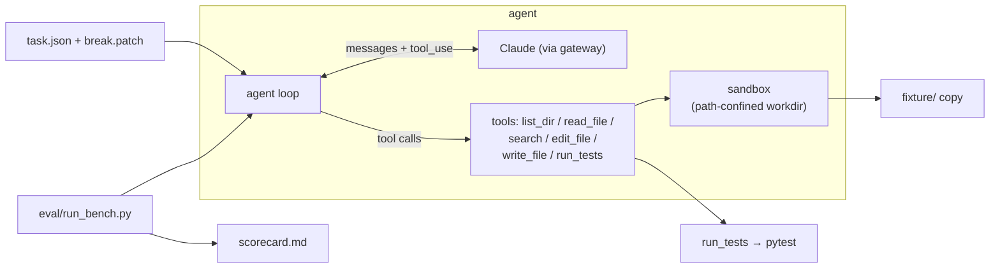

# fixpoint

> A test-driven autonomous coding agent, built from scratch.
> Hand it a repo and a red test suite — it locates the code, edits it, runs the
> tests, reads the red/green, and iterates until the suite is green. Then it's
> scored pass/fail on a controlled task set, with no self-reported results.

<!-- badges: keep to 3-4, all must be real & green -->


<!-- TODO(demo.gif): record 8–15s of one task going red → agent loop → green,
     save to docs/demo.gif, then uncomment the line below.

-->

## Why this exists

A coding agent built from scratch: hand it a repo with failing tests and it
locates the broken code, edits it, runs the tests, and iterates until green —
the core loop that tools like Claude Code run, small enough to read end-to-end.
What makes it more than a demo is measurement: every task is scored by a harness
that independently re-runs pytest, so **pass@1 is an observed number, never the
model's own word**.

## Architecture



## Quickstart

```bash
# Python 3.9 on macOS/Linux
python3.9 -m venv .venv
source .venv/bin/activate
pip install -r requirements.txt

# secrets: copy the template and fill in your gateway creds
cp .env.example .env
# edit .env → set ANTHROPIC_API_KEY and ANTHROPIC_BASE_URL

# solve a single task (streams the loop to your terminal)
python cli.py solve 001_mul_precedence

# run the whole benchmark → writes eval/scorecard.md
python cli.py bench
```

## Results

<!-- from `python cli.py bench` (label=baseline): 12 controlled tasks, no retrieval / no self-correction -->

| model            | pass@1        | avg steps | avg tokens | avg cost |
|------------------|:-------------:|:---------:|:----------:|:--------:|
| claude-opus-4.8  | 100% (12/12)  |    6.3    |   22,136   |  $0.12   |

Full run: **$1.44** total · **~21.6 s/task** avg wall-clock. Every verdict is the harness
independently re-running pytest against the pristine tests — the model never grades itself.

### Ablations

<!-- baseline row is real; the others land with v1 (V8 retrieval, V9 haiku) -->

| variant                          | pass@1        | avg steps |
|----------------------------------|:-------------:|:---------:|
| opus-4.8 (baseline)              | 100% (12/12)  |    6.3    |
| opus-4.8 + embedding retrieval   | _TODO (V8)_   |   _TODO_  |
| opus-4.8 + self-correction       | _TODO_        |   _TODO_  |
| haiku (weaker brain)             | _TODO (V9)_   |   _TODO_  |

## How it works

- **The loop** (`agent/loop.py`) — a ReAct cycle: the model sees the task, calls
  tools, observes results, iterates. Bounded by `max_steps` and a per-task USD cost
  budget; it stops when the model quits calling tools (or a guardrail trips).
- **The tools** (`agent/tools.py`) — `list_dir`, `read_file` (numbered lines),
  `search` (literal grep), `edit_file` (unique-match string replace), `write_file`,
  `run_tests` (pytest → compact PASS/FAIL). Every path is confined to the task
  workdir by `agent/sandbox.py`; errors come back as strings, never exceptions.
- **The task set** — a single pristine `fixture/`: a compact arithmetic-expression
  evaluator in three stages — `tokenizer` (source → tokens), `parser` (tokens → AST
  via recursive descent, with real operator precedence, left-associativity, and
  unary minus), and `evaluator` (AST → number; true division, divide-by-zero
  raises), over a shared `errors` hierarchy. The pristine library is fully green:
  51 pytest cases across the three stages plus end-to-end integration. Each task
  then applies a `break.patch` that breaks exactly one function, turning a known
  subset of those tests red; the agent has to make the suite green again.
- **Scoring** — after the agent stops, the harness restores the pristine test
  files (so a run can't cheat by editing tests), then independently re-runs the
  full `pytest`. A task is *solved* iff its target tests pass **and** no
  previously-green test newly fails (regression check). The model is never
  trusted to grade itself.

## Project layout

```text
agent/    loop, tools, sandbox, llm, config
tasks/    fixture/ (pristine lib + tests) + NNN_*/ (task.json + break.patch)
eval/     run_bench.py, scorecard.md
tests/    unit tests for the agent's own tools
cli.py    solve / bench entrypoints
```

## Limitations & non-goals

- Single fixture domain (a mini arithmetic-expression evaluator) — not a general
  code agent yet; generalizing to real repos with failing tests is the planned v2.
- Edits are exact string replacements (`edit_file`), not fuzzy / semantic patches.
- Test runner is pytest-only; `run_tests` parses its output.
- Cost / latency depend on the aggregation gateway; token accounting is an estimate.
- Not bit-reproducible: the LLM samples, so steps / cost vary run to run.
- (v1) embedding retrieval will be English-only (`bge-small-en`).

## License

MIT
